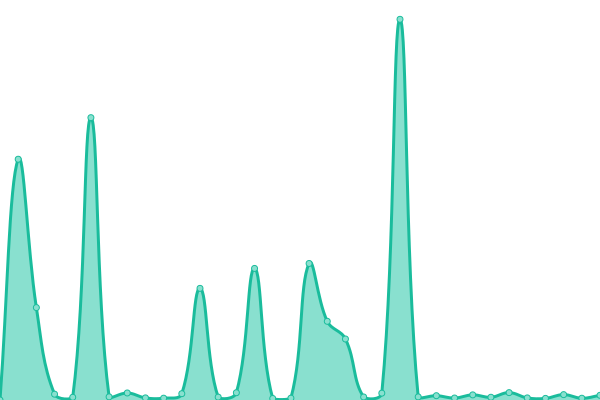
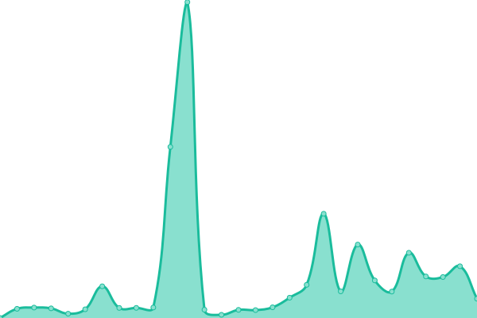
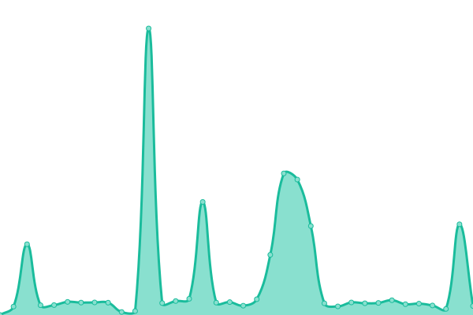
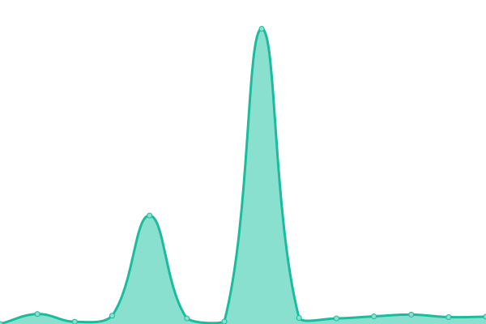

# [📈 Live Status](https://Happy-Vibes-Bot.github.io/status): <!--live status--> **🟩 All systems operational**

This repository contains the open-source uptime monitor and status page for [Happy Vibes Bot](https://Happy-Vibes-Bot.github.io/status), powered by [Upptime](https://github.com/upptime/upptime).

With [Upptime](https://upptime.js.org), you can get your own unlimited and free uptime monitor and status page, powered entirely by a GitHub repository. We use [Issues](https://github.com/Happy-Vibes-Bot/status/issues) as incident reports, [Actions](https://github.com/Happy-Vibes-Bot/status/actions) as uptime monitors, and [Pages](https://Happy-Vibes-Bot.github.io/status) for the status page.

<!--start: status pages-->
<!-- This summary is generated by Upptime (https://github.com/upptime/upptime) -->
<!-- Do not edit this manually, your changes will be overwritten -->
<!-- prettier-ignore -->
| URL | Status | History | Response Time | Uptime |
| --- | ------ | ------- | ------------- | ------ |
|  Happy Vibes Bot 1 | 🟩 Up | [happy-vibes-bot-1.yml](https://github.com/Happy-Vibes-Bot/status/commits/HEAD/history/happy-vibes-bot-1.yml) | 

 2017ms
     
 | 

<a href="https://Happy-Vibes-Bot.github.io/status/history/happy-vibes-bot-1">95.85%</a>
    

|  Happy Vibes Bot 2 | 🟩 Up | [happy-vibes-bot-2.yml](https://github.com/Happy-Vibes-Bot/status/commits/HEAD/history/happy-vibes-bot-2.yml) | 

 2166ms
     
 | 

<a href="https://Happy-Vibes-Bot.github.io/status/history/happy-vibes-bot-2">97.15%</a>
    

|  Happy Vibes Bot 3 | 🟩 Up | [happy-vibes-bot-3.yml](https://github.com/Happy-Vibes-Bot/status/commits/HEAD/history/happy-vibes-bot-3.yml) | 

 3554ms
     
 | 

<a href="https://Happy-Vibes-Bot.github.io/status/history/happy-vibes-bot-3">95.99%</a>
    

|  Happy Vibes Bot 4 | 🟩 Up | [happy-vibes-bot-4.yml](https://github.com/Happy-Vibes-Bot/status/commits/HEAD/history/happy-vibes-bot-4.yml) | 

 2030ms
     
 | 

<a href="https://Happy-Vibes-Bot.github.io/status/history/happy-vibes-bot-4">95.70%</a>
    

|  Happy Vibes Bot 5 | 🟩 Up | [happy-vibes-bot-5.yml](https://github.com/Happy-Vibes-Bot/status/commits/HEAD/history/happy-vibes-bot-5.yml) | 

 2218ms
     
 | 

<a href="https://Happy-Vibes-Bot.github.io/status/history/happy-vibes-bot-5">97.59%</a>
    

<!--end: status pages-->

[**Visit our status website →**](https://Happy-Vibes-Bot.github.io/status)

## 📄 License

- Powered by: [Upptime](https://github.com/upptime/upptime)
- Code: [MIT](./LICENSE) © [Happy Vibes Bot](https://Happy-Vibes-Bot.github.io/status)
- Data in the `./history` directory: [Open Database License](https://opendatacommons.org/licenses/odbl/1-0/)
